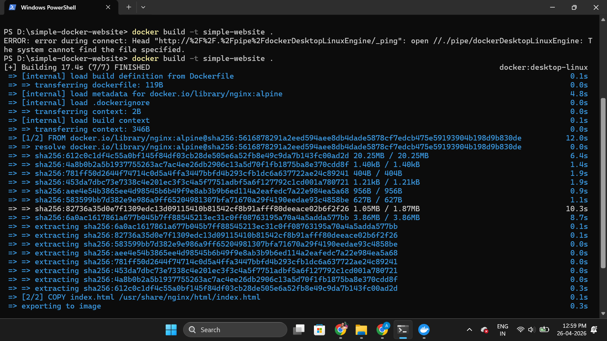
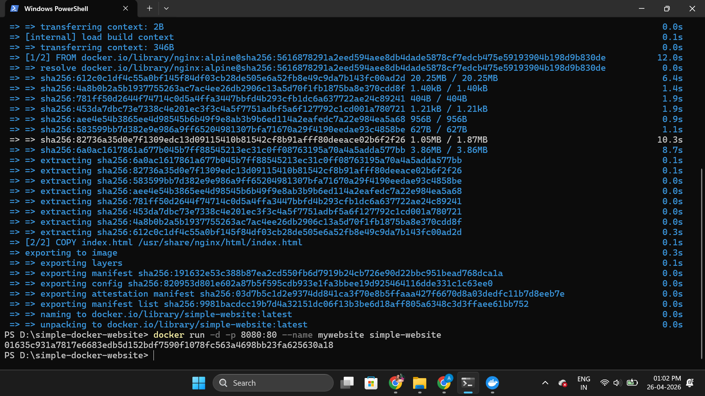
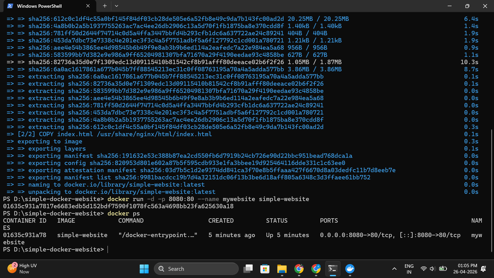

# Simple Docker Website

## Cloud + DevOps Assignment Project

This project is a simple static website deployed using Docker and Nginx.

It demonstrates:

* Creating a simple application
* Writing a Dockerfile
* Building Docker image
* Running Docker container
* Checking running containers using docker ps
* Uploading source code to GitHub
* Pushing Docker image to Docker Hub


## Project Files

* index.html
* Dockerfile
* README.md
* screenshots folder


## Dockerfile Used

```dockerfile
FROM nginx:alpine

COPY index.html /usr/share/nginx/html/index.html

EXPOSE 80
```


## Docker Commands Used

### Build Docker Image

```bash
docker build -t simple-website .
```

### Run Docker Container

```bash
docker run -d -p 8080:80 --name mywebsite simple-website
```

### Check Running Containers

```bash
docker ps
```

### Tag Docker Image

```bash
docker tag simple-website anagha23/simple-website
```

### Push to Docker Hub

```bash
docker push anagha23/simple-website
```


## Docker Hub Image Link

https://hub.docker.com/r/anagha23/simple-website


## GitHub Repository Link

https://github.com/anagha-chithra/simple-docker-website


## Screenshots

### Screenshot 1 — Docker Image Build




### Screenshot 2 — Running Container




### Screenshot 3 — docker ps Output




## Output

The website runs successfully inside Docker container using Nginx and is accessible at:

http://localhost:8080


## Submitted For

CipherSchool Cloud + DevOps Assignment
